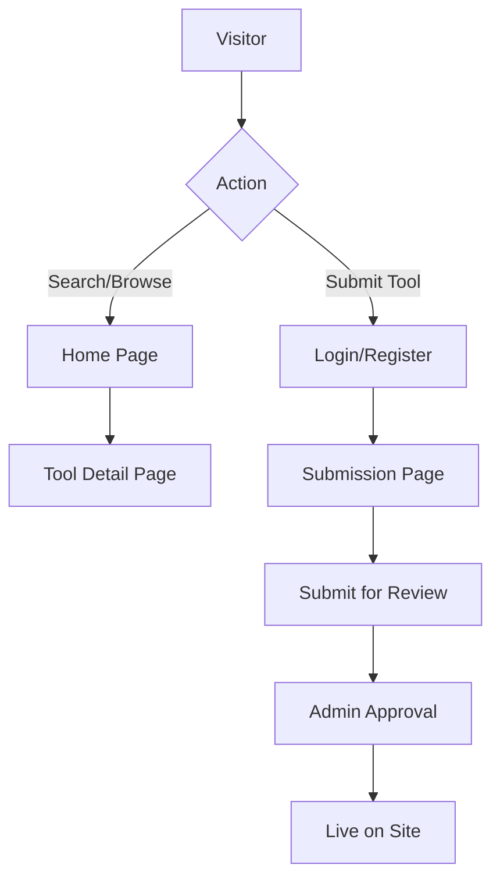

# Product Requirements Document - AI Tools Directory

## 1. Product Overview
The AI Tools Directory is a comprehensive, community-driven platform aggregating over 100+ AI tools across various domains (Text, Image, Audio, etc.). It aims to be the go-to resource for discovering, reviewing, and submitting the latest AI technologies, featuring advanced search capabilities and a user-friendly interface.

## 2. Core Features

### 2.1 User Roles
| Role | Registration Method | Core Permissions |
|------|---------------------|------------------|
| Visitor | No registration required | Browse tools, search/filter, view details and reviews. |
| Registered User | Email/Social Login (Supabase) | Submit new tools, write reviews, rate tools. |
| Admin | Pre-assigned | Approve/Reject tool submissions, moderate reviews, manage content. |

### 2.2 Feature Module
The platform requirements consist of the following main pages:
1. **Home Page**: Hero section with search, category navigation, featured/trending tools list.
2. **Tool Detail Page**: Comprehensive info, screenshots, user reviews/ratings, related tools.
3. **Submission Page**: Form for users to submit new AI tools.
4. **Auth Pages**: Login and Register pages.

### 2.3 Page Details
| Page Name | Module Name | Feature description |
|-----------|-------------|---------------------|
| **Home Page** | **Hero & Search** | Prominent search bar supporting keywords. Quick filters for pricing (Free, Paid, Freemium) and sorting. |
| | **Category Nav** | Sidebar or top bar listing categories (Text, Image, Audio, Video, Code, Business, 3D, Productivity). |
| | **Tool Grid** | Responsive grid displaying tool cards with logo, name, category, rating, and short description. Supports "Load More" or pagination for performance. |
| **Tool Detail Page** | **Info Header** | Large logo, title, website link button, pricing model, and overall rating. |
| | **Content Section** | Detailed description, key features list, screenshots/gallery. |
| | **Reviews Section** | List of user reviews with star ratings. Form for logged-in users to add a review. |
| **Submission Page** | **Tool Form** | Fields for Name, URL, Description, Category, Pricing, and Logo upload. |
| **Auth Pages** | **Sign In/Up** | Standard email/password login and social providers via Supabase Auth. |

## 3. Core Process
**User Journey & Submission Flow:**
Users explore tools via search or categories. If they find a missing tool, they log in to submit it. Admins review submissions before they go live.

## 4. User Interface Design
### 4.1 Design Style
- **Primary Color:** Deep Violet/Blue for AI theme.
- **Style:** Modern, card-based, clean typography (Inter or similar sans-serif).
- **Dark Mode:** Fully supported system-wide dark mode (defaulting to dark for tech feel).
- **Components:** Rounded corners, subtle gradients, glassmorphism effects for headers.

### 4.2 Page Design Overview
| Page Name | Module Name | UI Elements |
|-----------|-------------|-------------|
| Home Page | Tool Card | Card with hover effect. displaying icon, rating stars, and "Free/Paid" badge. |
| Detail Page | Layout | Two-column layout on desktop: Main content left, quick stats/link right. |

### 4.3 Responsiveness
- **Desktop-first** design ensuring high information density.
- **Mobile-adaptive:** Sidebar collapses to drawer; grid changes to single column. Touch-optimized buttons.

### 4.4 3D Scene Guidance (N/A)
Not applicable for this 2D web directory.
