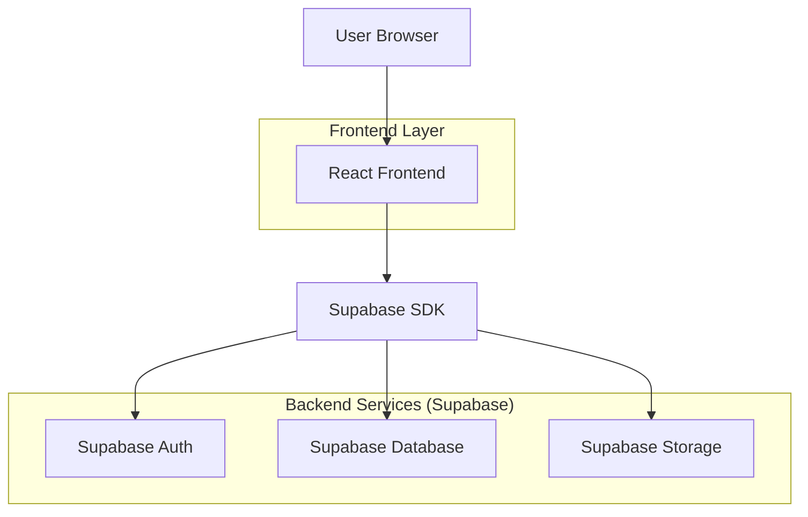
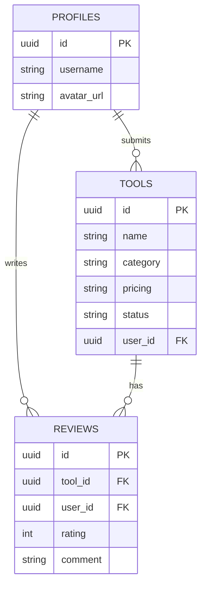

# Technical Architecture Document - AI Tools Directory

## 1. Architecture Design

The application utilizes a React frontend for a responsive user interface and Supabase for backend services (Database, Auth). This ensures scalability for the 100+ tools and dynamic user interactions like submissions and reviews.



## 2. Technology Description
- **Frontend:** React@18 + tailwindcss@3 + vite
- **Initialization Tool:** vite-init
- **Backend:** Supabase (PostgreSQL, Auth, Storage)
- **State Management:** React Context or simple hooks (sufficient for this scale).
- **Icons:** Lucide-React or Heroicons.

## 3. Route Definitions
| Route | Purpose |
|-------|---------|
| `/` | Home page with search, filtering, and tool listing. |
| `/tool/:id` | Detailed view of a specific tool with reviews. |
| `/submit` | Form for registered users to submit new tools. |
| `/login` | User authentication page. |
| `/admin` | (Optional) Admin dashboard for approving tools. |

## 4. API definitions
Interaction with Supabase is handled directly via the Client SDK.

### 4.1 Core Types
```typescript
interface Tool {
  id: string;
  name: string;
  description: string;
  url: string;
  category: string;
  pricing: 'Free' | 'Paid' | 'Freemium';
  image_url: string;
  status: 'pending' | 'approved';
  user_id: string; // Submitter
  created_at: string;
}

interface Review {
  id: string;
  tool_id: string;
  user_id: string;
  rating: number; // 1-5
  comment: string;
  created_at: string;
}
```

## 5. Server Architecture Diagram
Since we use Supabase-as-a-Service, the "server" logic is primarily database policies and triggers.

```mermaid
graph TD
  A[Client] -->|Read Public Data| B[(Database Tables: Tools, Reviews)]
  A -->|Write (Auth)| B
  B -->|RLS Policies| C[Access Control]
  C -->|Anon| D[Read Approved Tools]
  C -->|Auth User| E[Submit Tool / Review]
```

## 6. Data Model

### 6.1 Data Model Definition


### 6.2 Data Definition Language
```sql
-- Profiles table (extends auth.users)
CREATE TABLE profiles (
  id UUID REFERENCES auth.users(id) PRIMARY KEY,
  username TEXT,
  avatar_url TEXT,
  updated_at TIMESTAMP WITH TIME ZONE
);

-- Tools table
CREATE TABLE tools (
  id UUID DEFAULT gen_random_uuid() PRIMARY KEY,
  name TEXT NOT NULL,
  description TEXT,
  url TEXT NOT NULL,
  category TEXT NOT NULL,
  pricing TEXT CHECK (pricing IN ('Free', 'Paid', 'Freemium')),
  image_url TEXT,
  status TEXT DEFAULT 'pending' CHECK (status IN ('pending', 'approved', 'rejected')),
  user_id UUID REFERENCES auth.users(id),
  created_at TIMESTAMP WITH TIME ZONE DEFAULT NOW()
);

-- Reviews table
CREATE TABLE reviews (
  id UUID DEFAULT gen_random_uuid() PRIMARY KEY,
  tool_id UUID REFERENCES tools(id) ON DELETE CASCADE,
  user_id UUID REFERENCES auth.users(id),
  rating INTEGER CHECK (rating >= 1 AND rating <= 5),
  comment TEXT,
  created_at TIMESTAMP WITH TIME ZONE DEFAULT NOW()
);

-- Enable RLS
ALTER TABLE tools ENABLE ROW LEVEL SECURITY;
ALTER TABLE reviews ENABLE ROW LEVEL SECURITY;

-- Policies
-- Everyone can read approved tools
CREATE POLICY "Public tools are viewable by everyone" ON tools
  FOR SELECT USING (status = 'approved');

-- Auth users can insert tools
CREATE POLICY "Users can insert tools" ON tools
  FOR INSERT WITH CHECK (auth.uid() = user_id);

-- Everyone can read reviews
CREATE POLICY "Reviews are viewable by everyone" ON reviews
  FOR SELECT USING (true);

-- Auth users can insert reviews
CREATE POLICY "Users can insert reviews" ON reviews
  FOR INSERT WITH CHECK (auth.uid() = user_id);
```
